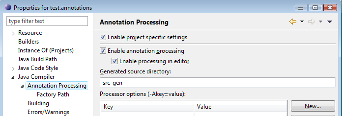
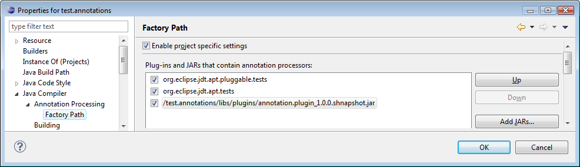

annotation-processor.example
============================

Projektbeschreibung
-------------------

Beispiel für einen Annotations Prozessor realisiert als Eclipse Plugin.

Motivation
----------

Mit dem Beispiel sollen folgende Dinge gezeigt werden:

1. Prinzipiell ist es möglich Annotationen zur Erhöhung der Typsicherheit 
genutzt werden. Dies wird gezeigt durch das Bereitstellen einer Annotation 
Cardinal welche an int Variablen gesetzt werden kann. Mittels der @Cardinal
Annotation kann der Wertebereich des int eingeschränkt werden. Die Annotation
generiert eine entsprechende Wrapper Klasse welche im Constructor über 
Vorbedingungen nur gültige Werte zulässt. Dadurch treten die Fehler stets sehr 
früh im Programm - an den Datenquellen wie Eingabefelder, Datenbankabfragen oder 
direkten Zuweisungen - auf und nicht erst bei der Verwendung der Eingabewerte.

2. Annotationen können mittels des *pluggable-annotation-processing-api* ohne
eigene Nutzung des Reflection API verwendet werden um dem Compiler bei der
Überprüfung der Quelltexte nützliche Hinweise für Fehlermeldungen zu geben. 

3. Es gibt wie immer 2 Wege der Realisierung - entweder the eclipse way - 
implements AnnotationProcessor - oder die Realisierung per Java Standard -
extemds AbstractProcessor. 

Quellen
-------

 * [Erstellen von Annotationen](http://www.javabeat.net/2007/06/java-6-0-features-part-2-pluggable-annotation-processing-api/http://www.javabeat.net/2007/06/java-6-0-features-part-2-pluggable-annotation-processing-api/)
 * [Einbindung in Eclipse](http://www.eclipse.org/jdt/apt/introToAPT.php)
 
 
Benutzung/Ausprobieren
----------------------

1. Projekt lokal ausschecken - git clone
2. Export als jar - mittels Eclipse Export Deployable Features
3. Einbinden des jars in einem Testprojekt über Projekt/Properties/JavaCompiler/Annotation Processing
3.1. src-gen als Ausgabe Verzeichnis festlegen

3.2. Annotation Processor festlegen

*Beispiel Klasse zum Testen der Annotationen*

	package test.annotations;
	
	import gh.funthomas424242.annotations.numbers.Cardinal;

	public class ClassUnderTest {
	     
	    @Cardinal (max=  20,min=3)
	    private int counter =0; 
	    
	    
	    @Cardinal (min=340,max=60)
	    public static void main (String[] args){
		
		// DOES not work before java 8
		@Cardinal (max=  -20,min=6)
		int value = 8;
		 
	    }
	    
	    @Cardinal (max=  20,min=3) 
	    public int count ( @Cardinal (max=  65677,min=5) final Integer in ){
		return in;
		
	    }
	
	}

