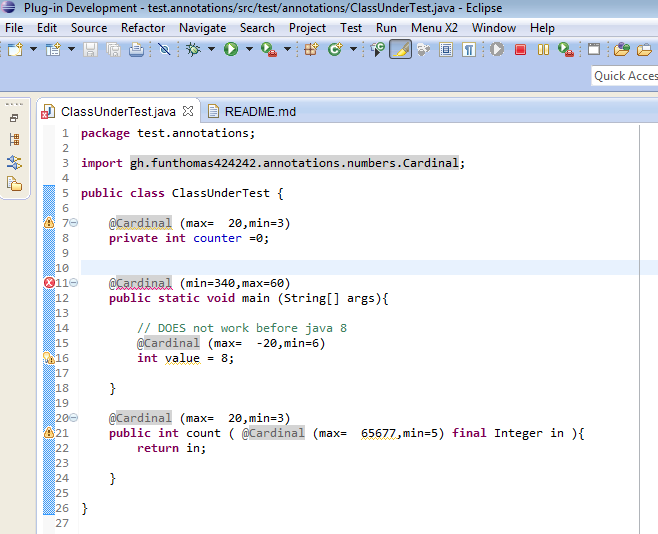
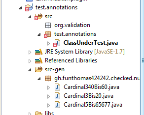

annotation-processor.example
============================

Projektbeschreibung
-------------------

Beispiel für einen Annotations Prozessor realisiert als Eclipse Plugin.

Motivation
----------

Mit dem Beispiel sollen folgende Dinge gezeigt werden:

* Prinzipiell ist es möglich Annotationen zur Erhöhung der Typsicherheit 
zu nutzen. Dies wird gezeigt durch das Bereitstellen einer Annotation 
Cardinal welche an int Variablen gesetzt werden kann. Mittels der @Cardinal
Annotation kann der Wertebereich des int eingeschränkt werden. Die Annotation
generiert eine entsprechende Wrapper Klasse welche im Constructor über 
Vorbedingungen nur gültige Werte zulässt. Dadurch treten die Fehler stets sehr 
früh im Programm - an den Datenquellen wie Eingabefelder, Datenbankabfragen oder 
direkten Zuweisungen - auf und nicht erst bei der Verwendung der Eingabewerte.

* Annotationen können mittels des *pluggable-annotation-processing-api* ohne
eigene Nutzung des Reflection API verwendet werden um dem Compiler bei der
Überprüfung der Quelltexte nützliche Hinweise für Fehlermeldungen zu geben.
    
 * Das *pluggable-annotation-processing-api* wurde mit *JavaSE 5* eingeführt.
Der eigene Annotation Processor musste dabei von der Klasse *AnnotationProcessor*
abgeleitet werden. Bei der Implemmentierung wurden dann die 
[Java 5 Mirror APIs](http://docs.oracle.com/javase/1.5.0/docs/guide/apt/mirror/overview-summary.html)
benutzt. Diese Implementierung wurde in *Eclipse Version 3.2* vom *JDT-APT Feature* 
unterstützt. So konnten Hinweise der AnnotationProcessors direkt beim Editieren
ausgewertet werden. Bei dieser API musste immer eine Factory bereitgestellt werden.

 * Mit *JavaSE 6* wurde das *pluggable-annotation-processing-api* bereinigt und
konsequent in den *javax.annotation.processing* Bereich ausgelagert. Diese API 
wurde dann durch *Eclipse Version 3.3* vom *JDT-APT Feature* unterstützt.
Bei dieser API wird von der Klasse *AbstractProcessor* abgeleitet und
es wird keine separate Factory benötigt.

* Um einen Annotation Processor für eigene Annotationen bereitzustellen welcher
das *pluggable-annotation-processing-api* unterstützt, kann man einfach
ein Eclipse Plugin schreiben welches den Extension Point 
*org.eclipse.jdt.apt.core.annotationProcessorFactory* realisiert. Es empfiehlt 
sich je Plugin konsequent nur ein API (entweder das von JDK5 oder das von JDK6)
zu nutzen. Ein Mix ist nicht empfohlen.

* Die Benutzung des *AnnotationProcessor* kann dann auf folgenden Wegen geschehen:
 * Aufruf auf der Kommandozeile (pure Java ohne Eclipse) mit: 

  > javac -processor packages.MyAnnotationsProcessorClass TestClass.java

 * Aufruf über das *maven-compiler-plugin* version 3.1. Dort ist in der 
Konfiguration das *AnnotationProcessor Tag* einzutragen.

 * Einbinden in Eclipse über die Projektproperties und dort in der Compiler 
Konfiguration.

 * Installation in Eclipse als Plugin. Diese Methode hat den Vorteil, das der 
Processor gleich im Projektmenü auswählbar ist und nicht per Dateipfad zum 
JAR gesucht werden muss.

Quellen
-------

 * [Erstellen von Annotationen](http://www.javabeat.net/2007/06/java-6-0-features-part-2-pluggable-annotation-processing-api/http://www.javabeat.net/2007/06/java-6-0-features-part-2-pluggable-annotation-processing-api/)
 * [Einbindung in Eclipse](http://www.eclipse.org/jdt/apt/introToAPT.php)
 * [JDT Docs für Indigo](http://help.eclipse.org/indigo/index.jsp?topic=%2Forg.eclipse.jdt.doc.isv%2Fguide%2Fjdt_apt_getting_started.htm)
 
 
Benutzung/Ausprobieren
----------------------

1. Projekt lokal ausschecken - git clone
2. Export als jar - mittels Eclipse Export Deployable Features
3. Einbinden des jars in einem Testprojekt über Projekt/Properties/JavaCompiler/Annotation Processing

3.1. src-gen als Ausgabe Verzeichnis festlegen

3.2. Annotation Processor festlegen

3.3. Beispiel Klasse zum Testen der Annotationen

	package test.annotations;
	
	import gh.funthomas424242.annotations.numbers.Cardinal;

	public class ClassUnderTest {
	     
	    @Cardinal (max=  20,min=3)
	    private int counter =0; 
	    
	    
	    @Cardinal (min=340,max=60)
	    public static void main (String[] args){
		
		// DOES not work before java 8
		@Cardinal (max=  -20,min=6)
		int value = 8;
		 
	    }
	    
	    @Cardinal (max=  20,min=3) 
	    public int count ( @Cardinal (max=  65677,min=5) final Integer in ){
		return in;
		
	    }
	
	}

3.4. Testklasse mit Markierungen

3.5. Generierte Klassen

